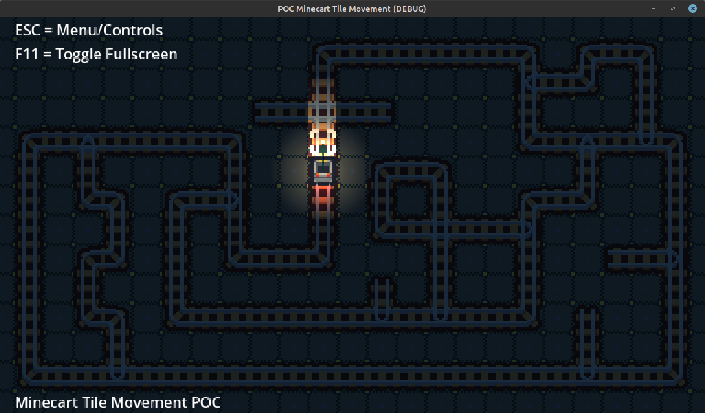
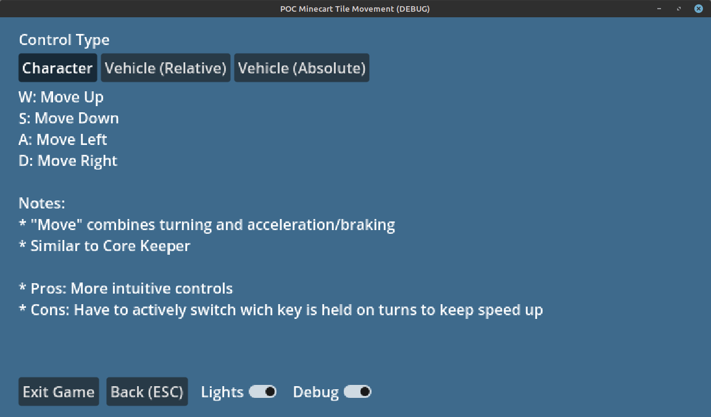

# Godot Minecart/Wagon controller based on tiles [Game POC](https://deniszholob.itch.io/godot-poc-minecart-tile-movement)

Proof of concept on controlling a minecart along tiles in a tileset similar to minecart in [Core Keeper](https://store.steampowered.com/app/1621690/Core_Keeper/).

Additionally able to switch to different control types similar to trains in [Factorio](https://store.steampowered.com/app/427520/Factorio/)

> **Play it on [Itch.io](https://deniszholob.itch.io/godot-poc-minecart-tile-movement)!**

## Deployments 

- See [Contributing](./CONTRIBUTING.md) for technical details.
- See [Assets Readme](./assets/README.md) for asset details.

# Support Me!

If you find the demo/code useful, consider:

- Donating Ko-fi: https://ko-fi.com/deniszholob
- Supporting on Patreon: https://www.patreon.com/deniszholob

# YouTube Demo

# Screenshots

